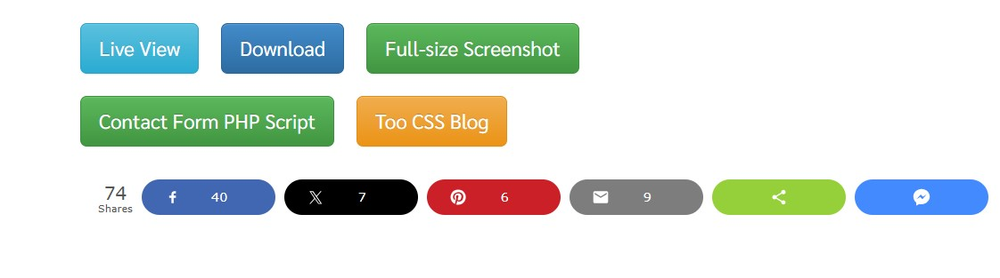

## Capstone Project-Introduction to Cloud Computing

# Capstone Project: E-Commerce Platform Deployment with Git, Linux, and AWS
Project Instructions:

In this project I will be developing an e-commerce website for a new online marketplace named "MarketPeak." This platform will feature product listings, a shopping cart, and user authentication.To implement this project I will use Git for version control, the develpoment platform will be in a Linux environment, and deploy it on an AWS EC2 instance. You can find a suitable website template here to kickstart your development

## Tasks

**1. Implement Version Control with Git**

## 1.1. Initialize Git Repository


I created a project directory or folder and named it "Marketpeak_Ecommerce using vscode cli i used the following command

 `mkdir MarketPeak_Ecommerce`

 `cd MarketPeak_Ecommerce`

 `git init`

 `git add .`

 `git commit -m "...."`

 `git push`
 
 ## 1.2. Obtain and prepare the E-commerce Website Template
 I obtained and prepared a pre-existing e-commerce website template
 
 I downloaded a Website Template by visiting (Tooplate)
 

 I obtained also the url
 [Template](https://www.tooplate.com/view/2130-waso-strategy)
 
 ## 1.2 Prepare the Website Template: 
 Extract the downloaded template into my project directory,
  marketpeak_Ecommerce  
                    

## 1.3. Stage and commit the Template to Git
 ```git add .
 git config --global user.name "YourUsername"
 git config --global user.email "youremail@example. com"
 git commit -m "Initial commit with basic e-commerce  site structure"
 ```
 ## 1.4 Push the code to your Github repository


# 2. AWS Deployment
## Task 2.1: Setup an AWS EC2 instance
* Log into the AWS management Console.
* Launch an EC2 Instance using an Amazon linux AMI
* Connect to the instance using SSH
* The image below shows the EC2 on AWS Console:


## 2.2. Clone the repository on the Linux Server
  * Navigate to my repository in my github console
  * i selected the `code` as highlighted in the image below
  * Using HTTPS Method


  ## Note: With AWS Linux, git is not preinstalled so i have to install it manually by using the following command
  
   `sudo yum istall git`

   `git clone https://github.com/omoefe123/MarketPeak_Ecommerce.git`
   
 The image below shows the cloning interface on the cli


# Task 3. Installing a Web Server on EC2
 Using yum package manager for htttpd software
 The below command was used to install Apache

 `sudo yum update -y`

`sudo yum install httpd -y`

`sudo systemctl start httpd`

`sudo systemctl enable httpd`


